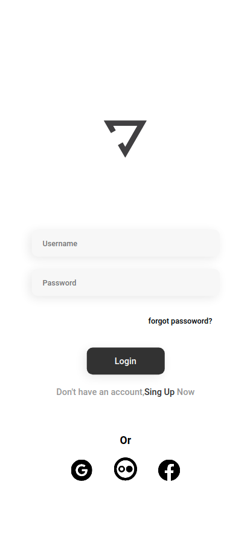
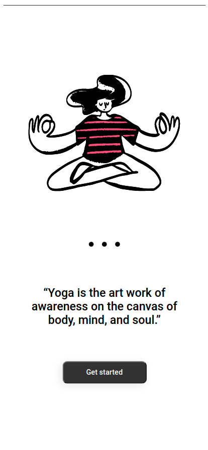

# YOGA INTERFACE

<!---Esses são exemplos. Veja https://shields.io para outras pessoas ou para personalizar este conjunto de escudos. Você pode querer incluir dependências, status do projeto e informações de licença aqui--->

 

> Resultado do projeto Yoga.
### Ajustes e melhorias

O projeto ainda está em desenvolvimento e as próximas atualizações serão voltadas nas seguintes tarefas:

- [x] Criação do HTML e CSS da pagina de login
- [x] Criação do HTML e CSS da pagina de Sign up
- [ ] Criação do HTML e CSS da pagina de forgot passoword
- [ ] Criação do CSS responsivo

## 🤝 Colaboradores

Agradecemos às seguintes pessoas que contribuíram para este projeto:

<table>
  <tr>
    <td align="center">
      <a href="www.github.com/yolmat">
         
        
          <b>Yolmat</b>
        
      </a>
    </td>
  </tr>
</table>

[⬆ Voltar ao topo](#nome-do-projeto) 